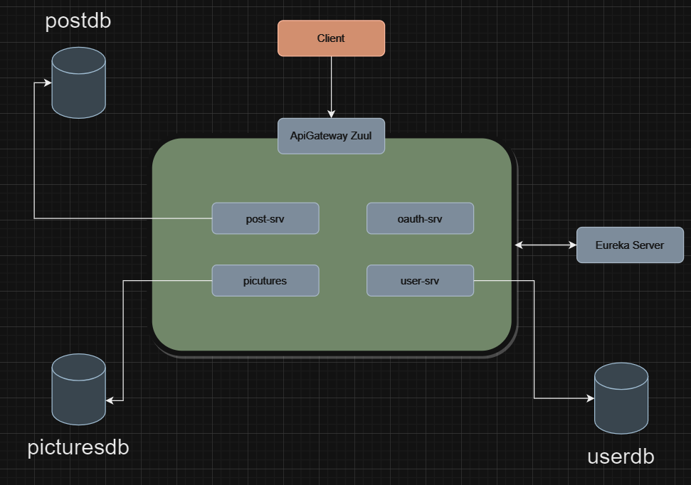

# socialmedia_solides-app

## Aquitetura da aplicação:

Configurando o Projeto

### Requisitos:
1. JDK 11
2. Maven

## Executando Backend:

#### Na pasta raiz do projeto (\socialmedia_solides-app) executar o comando `docker-compose up` para que as bases de dados sejam criadas:

1. postdb
2. picturesdb
3. userdb

### Após a criação das bases de dados os serviços podem ser iniciados. Eles devem ser iniciados na ordem descrita abaixo:

1. eureka-srv
2. api-gateway-zuul
3. user-srv
4. oauth-srv
5. post-srv
6. pictures-srv

### Com os seguintes comandos:

1. Vá para o diretorio raíz de projeto e execute `mvn clean install -DskipTests=true -U`
2. Execute o comando `mvn spring-boot:run` para iniciar a aplicação;

## Observação:
Após subir todos os microserviços a API gateway pode levar alguns minutos para começar a responder, caso você realize alguma chamada nesse meio tempo, pode receber esse retorno:

`{
"timestamp": "2023-11-16T05:17:31.169+00:00",
"status": 500,
"error": "Internal Server Error",
"message": ""
}`

Basta aguardar um minutinho e tentar novamente =))

### Mapeamento das operações do sistema

1. Deve-se importar o arquivo [postman_collection.json](..%2F..%2FUsers%2Fnostr%2FDownloads%2Fsocialmedia_solides.postman_collection.json) no Postman.
2. Criar as variáveis e atribuir seus devidos valores: 
`api-gateway = 'http://localhost:8765', 
username = (usuário cadastrado), 
password = (password cadastrado), 
client-name = myappname e
client-secret= myappsecret, `.

   Caso prefira, pode fazer o dowload do arquivo JSON referente as variaveis por aqui:
[postman_environment.json](..%2F..%2FUsers%2Fnostr%2FDownloads%2Fsocialmedia_solides-env.postman_environment.json)

3. Cadastrar um novo usuário através do POST `/user-srv/users`, enviado o seguinte body:

    `{
"name": "nome",
"email": "email",
"password": "123456",
"roles":[
{
"name": "ROLE_ADMIN"
}
]
}`

4. Depois de cadastrar o usuário é necessário executar a operação getToken (POST `/oauth/token`) antes de iniciar os testes de outras operações.

### Operações mapeadas

### Auth
- generate token: POST `/oauth-srv/oauth/token`

### User
- create user: POST `/user-srv/users`
- find user by id: GET `/user-srv/users/:id`
- find user by email: GET `/user-srv/users/search?email=email@gmail.com`

#### Post:
- create post: POST `/posts-srv/posts`
- find post by id: GET `/posts-srv/posts/:id`
- delete post by id: DELETE `/posts-srv/posts/:id`

#### Comentários:
- create comment: POST `/posts-srv/comments`
- find comment by id: GET `/posts-srv/comments/:id`
- find comment by user: GET `/posts-srv/comments?user=user@user.com.br`
- delete comment by id: DELETE `/posts-srv/comments/:commentId/post/:postId`

#### Pictures:
- create album: POST `/pictures-srv/album`
- find album by id: GET `/pictures-srv/album/:id`
- add images to album: POST `/pictures-srv/album/photos`
- delete comment by id: DELETE `/pictures-srv/album/:id`

## Diagramas das tabelas criadas pelo docker-compose
### picturesdb:

### userdb:

### postdb:

### Pré requisitos da API:

### Segurança 
Permitir o cadastro de usuários e login com autenticação via token JWT.

### Post 
###### Permitir o cadastro e consulta de posts com texto, imagens e links.
###### Apenas o criador do post poderá ter permissão para excluí-lo.

### Comentários 
###### Suportar a adição e exclusão de comentários em posts.
###### Os posts poderão ser visíveis a todos os usuários.
###### Apenas o criador do comentário poderá ter permissão para excluí-lo.

### Fotos 
###### Permitir a criação de álbuns de fotos.
###### As fotos dos álbuns poderão ser visíveis a todos
